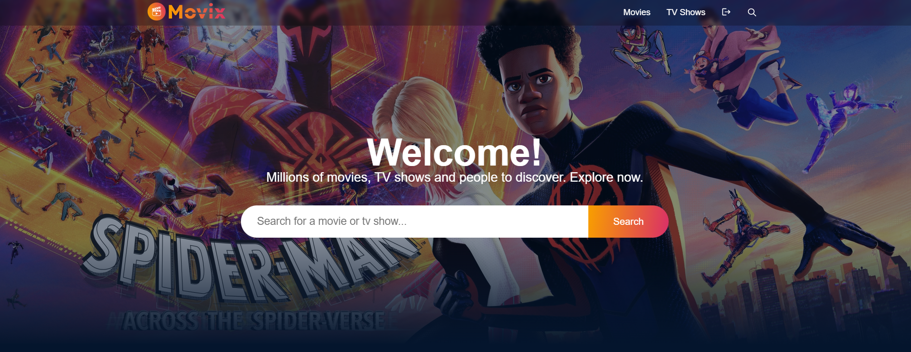
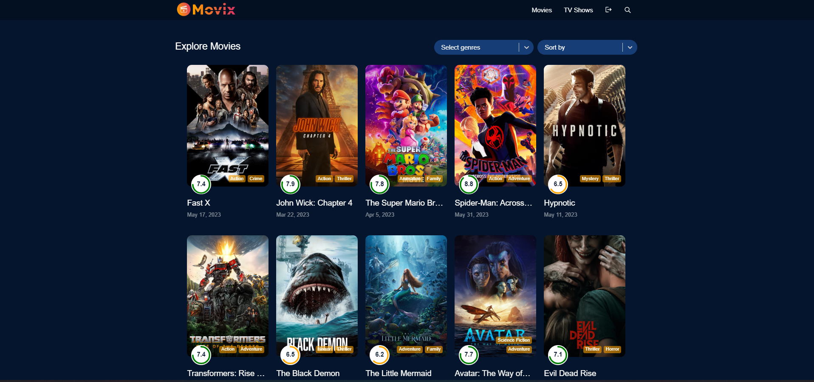

# Movix-using-React-Django

Movix is a full-stack web application that serves as a clone of popular streaming platforms like Netflix and Hotstar. The frontend of the application is built using ReactJS and React-Redux, while the backend utilizes the Django REST Framework.
On the backend, users have the ability to register and log in to the application. Authentication is managed through the use of JWT tokens, ensuring secure access to the platform. In the event that a user forgets their password, they can utilize the "change password with email" feature. This functionality enables them to receive an email containing instructions on how to reset their password.
For the frontend, real-time data of movies and TV shows is fetched from the TMDB website using React JS. However, users are only able to view their desired TV shows or movies after completing the payment process. The payment integration is handled through the PayPal sandbox, ensuring a secure and seamless transaction experience.

## Live Project Link

The project is hosted on Netlify and can be accessed using the following link - https://movixplay.netlify.app/

## Features

- Full-stack web authentication
- Real-Time Data: The application fetches real-time data of movies and TV shows from the TMDB website.
- User registration and login with "Change password with email" feature for resetting passwords
- JWT token-based authentication
- PayPal payment integration for subscription-based access
- User-friendly frontend

## Technologies Used

The following technologies were used in the development of this project:

- ReactJS - A JavaScript library for building user interfaces
- React-Redux - To read data from a Redux store, and dispatch actions to the store to update state.
- Django - A high-level Python web framework
- Django REST Framework - A powerful and flexible toolkit for building Web APIs
- JSON Web Tokens (JWT) - A compact, URL-safe means of representing claims to be transferred between two parties
- PayPal Sandbox - A payment gateway for online transactions
- TMDB API - An API for accessing movie and TV show data

## Conclusion

Movix is a full-stack web application that replicates popular streaming platforms like Netflix and Hotstar. It allows users to register, log in, browse a collection of movies and TV shows, and watch them after successful payment. The frontend is built using ReactJS and React-Redux, while the backend is powered by Django REST Framework.
